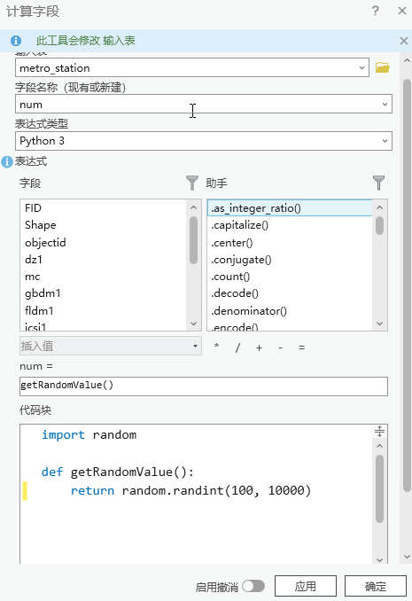

# ArcGIS Pro 设置字段值为随机数

> 注：测试环境 ArcGIS Pro 3.0.2

## 背景

制作测试数据的时候，编造数值是个头疼的问题，使用随机数是一个不错的办法。本文结合自己的经验分享两种设置字段值为随机数的方法。
## 一、方法一：使用 Arcade 脚本

参考脚本
```python
# 生成 100 到 10000 之间的随机整数
Round((Random() * 9900 + 100), 0)
```


## 二、方法二：使用 Python 脚本

参考脚本
```python
import random

def getRandomValue():
    return random.randint(100, 10000)
```



> 注意事项：如果执行计算字段功能时，属性表中存在选中的行，则此功能只会针对选中的那一行进行计算。

## 参考资料

[1]. [Math functions | ArcGIS Arcade](https://developers.arcgis.com/arcade/function-reference/math_functions/#random)
