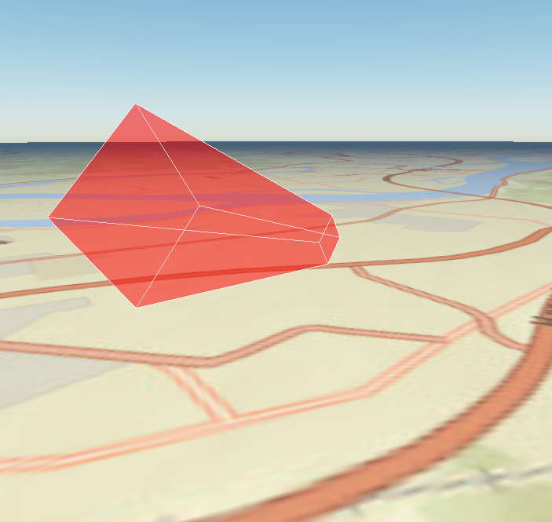
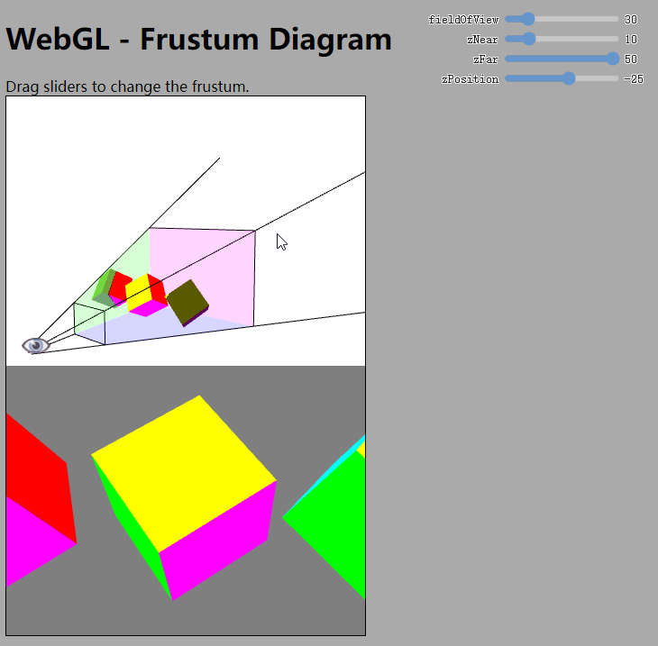
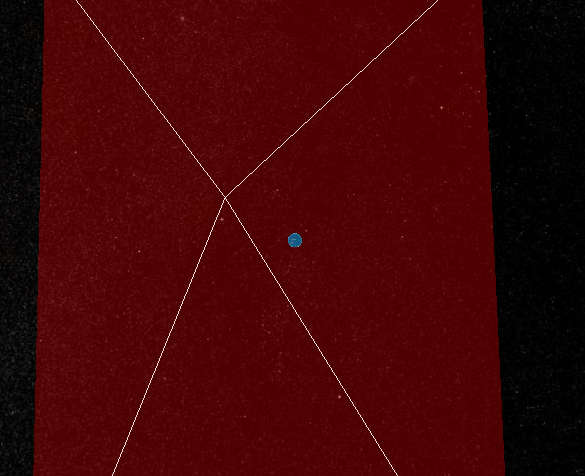
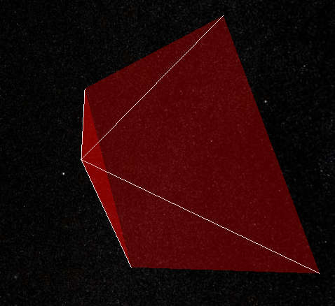
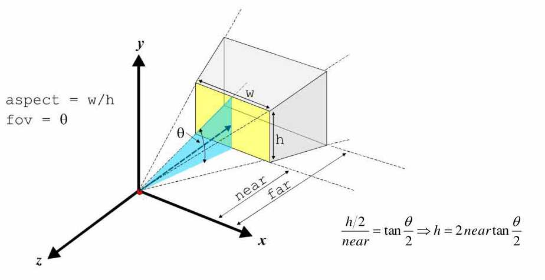
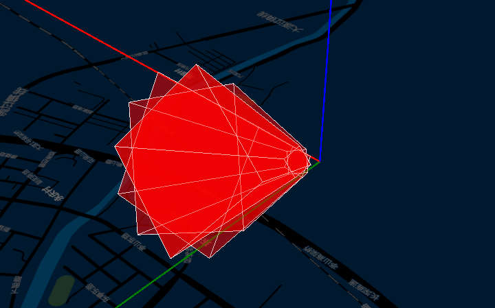
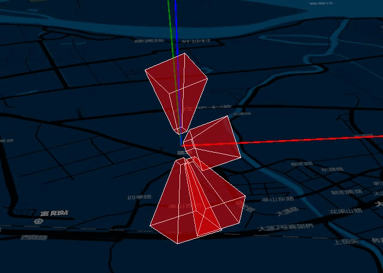
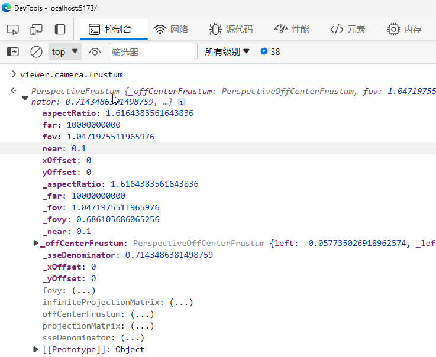
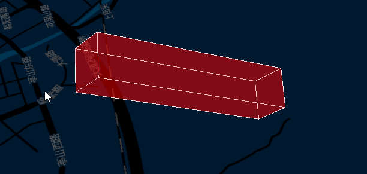
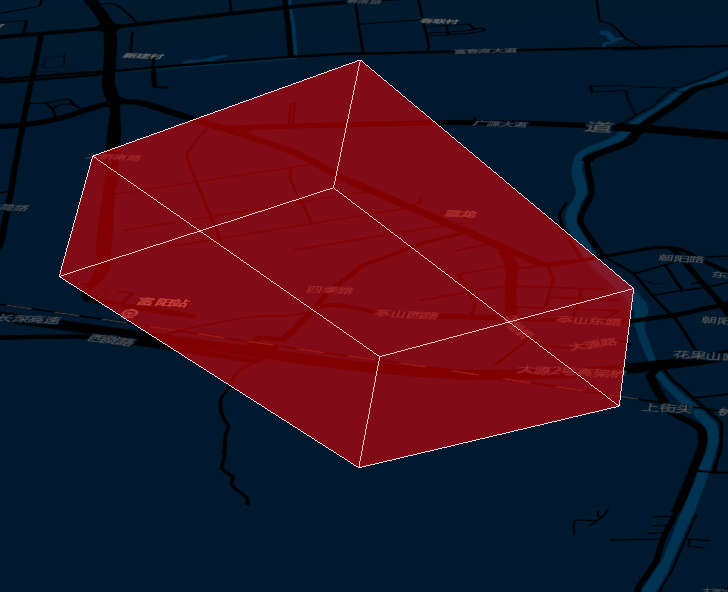

# 理解 Cesium 中的相机（2）视锥体

## 背景

根据 Cesium API文档，相机由位置（position）、姿态（orientation）和视锥体（frustum）定义。<sup>[1]</sup> position 和 orientation [理解 Cesium 中的相机（1）](./camera.md)已经梳理过，本文尝试梳理 frustum。

## 一、绘制一个视锥体



绘制出来的效果是一个[棱台](https://baike.baidu.com/item/%E6%A3%B1%E5%8F%B0/5612962).

关键代码参考了博文[cesium创建视椎体（可动态旋转）](https://blog.csdn.net/CheryW/article/details/132673735)

```js
// 视锥体position
let origin = Cesium.Cartesian3.fromDegrees(120, 30, 500);

// 地图视野定位
viewer.camera.setView({
  destination: origin,
  orientation: {
    heading: Cesium.Math.toRadians(0),
    pitch: Cesium.Math.toRadians(-45),
    roll: 0
  }
});

// 视锥体方向参数
let heading = 0
let pitch = -Math.PI/4
let roll = 0
let hpr = new Cesium.HeadingPitchRoll(heading, pitch, roll)
let orientation = Cesium.Quaternion.fromHeadingPitchRoll(hpr)

// 视场角：度
const fov = 30
// 近截面的距离
const near = 100
// 远截面的距离
const far = 500

// 平面的宽高比
const aspectRatio = 1

addFrustum(origin, orientation, fov, near, far, aspectRatio)

// 创建视锥体及轮廓线
function addFrustum(position, orientation, fov, near, far, aspectRatio) {
  let frustum = new Cesium.PerspectiveFrustum({
    // 查看的视场角，绕Z轴旋转，以弧度方式输入
    // fov: Cesium.Math.PI_OVER_THREE,
    fov: Cesium.Math.toRadians(fov),
    // 视锥体的宽度/高度
    aspectRatio: aspectRatio,
    // 近面距视点的距离
    near: near,
    // 远面距视点的距离
    far: far,
  });
  let instanceGeo = new Cesium.GeometryInstance({
    geometry: new Cesium.FrustumGeometry({
      frustum: frustum,
      origin: position,
      orientation: orientation,
      vertexFormat: Cesium.VertexFormat.POSITION_ONLY,
    }),
    attributes: {
      color: Cesium.ColorGeometryInstanceAttribute.fromColor(
        new Cesium.Color(1.0, 0.0, 0.0, 0.3)
      ),
    },
  });
  let instanceGeoLine = new Cesium.GeometryInstance({
    geometry: new Cesium.FrustumOutlineGeometry({
      frustum: frustum,
      origin: position,
      orientation: orientation,
    }),
    attributes: {
      color: Cesium.ColorGeometryInstanceAttribute.fromColor(
        new Cesium.Color(1.0, 1.0, 1.0, 1)
      ),
    },
  });

  let primitive = new Cesium.Primitive({
    geometryInstances: [instanceGeo],
    appearance: new Cesium.PerInstanceColorAppearance({
      closed: true,
      flat: true,
    }),
    asynchronous: false,
  });

  let primitive1 = new Cesium.Primitive({
    geometryInstances: [instanceGeoLine],
    appearance: new Cesium.PerInstanceColorAppearance({
      closed: true,
      flat: true,
    }),
    asynchronous: false,
  });
  viewer.scene.primitives.add(primitive);
  viewer.scene.primitives.add(primitive1);
}
```
## 二、frustum 的含义

### 1、字面意思

直接用词典翻译的意思为[平截头体](https://dict.cn/search?q=frustum)。

Unity 3D 中文文档中的翻译为**视锥体**<sup>[2]</sup>。

three.js 中文文档中的翻译为**视锥体**<sup>[2]</sup>。

### 2、Cesium 的解释

视锥体由 6 个平面定义。每个平面由一个 Cartesian4 对象表示，其中 x、y 和 z 分量定义垂直于平面的单位向量，w 分量是平面到原点/摄影机位置的距离。<sup>[1]</sup>

> 感觉 Cesium 的解释并不深入，并且没有更多的参考资料了。

### 3、[WebGL - 图解 Frustum](https://webglfundamentals.org/webgl/frustum-diagram.html)



这个[图解](https://webglfundamentals.org/webgl/frustum-diagram.html)是一个可调整参数的demo，只提供了 fov、near、far、position 来提供测试。

从这个 demo 可以看出，只有在视锥体范围内的图形才可见，fov 可以调整视野宽广度，near 和 far 可以调整视野起点（近处）和视野终点（远处）, position 可以调整距离目标的距离。

### 4、个人的粗略理解

在 Cesium 程序中的每一帧画面中，我们能看到的内容，不仅取决于相机的位置（position）、姿态（orientation），还取决于相机视锥体（frustum）。

- Cesium 程序只对视锥体之内的图形进行绘制，我们也只能只能看到视锥体之内的内容。

- 绘制视锥体之内的图形时，按照近大远小、近处遮挡远处、近处清晰远处模糊的逻辑进行绘制。

> 为什么视锥体是是方形的？因为屏幕是方形的。

## 三、绘制Cesium程序中的相机的视锥体





关键代码如下：

```js
/**
 * 绘制相机的视锥体
 * @param {Cesium.Viewer} viewer 
 * @param {Cesium.Camera} camera 
 */
function drawFrusrum(viewer, camera) {
  let instanceGeo = new Cesium.GeometryInstance({
    geometry: new Cesium.FrustumGeometry({
      frustum: camera.frustum.clone(),
      origin: camera.position.clone(),
      orientation: Cesium.Quaternion.fromHeadingPitchRoll(new Cesium.HeadingPitchRoll(camera.heading, camera.pitch, camera.roll)),
      vertexFormat: Cesium.VertexFormat.POSITION_ONLY,
    }),
    attributes: {
      color: Cesium.ColorGeometryInstanceAttribute.fromColor(
        new Cesium.Color(1.0, 0.0, 0.0, 0.3)
      ),
    },
  })
  let primitive = new Cesium.Primitive({
    geometryInstances: [instanceGeo],
    appearance: new Cesium.PerInstanceColorAppearance({
      closed: true,
      flat: true,
    }),
    asynchronous: false,
  })

  viewer.scene.primitives.add(primitive)

  let instanceGeoLine = new Cesium.GeometryInstance({
    geometry: new Cesium.FrustumOutlineGeometry({
      frustum: camera.frustum.clone(),
      origin: camera.position.clone(),
      orientation: Cesium.Quaternion.fromHeadingPitchRoll(new Cesium.HeadingPitchRoll(camera.heading, camera.pitch, camera.roll)),
    }),
    attributes: {
      color: Cesium.ColorGeometryInstanceAttribute.fromColor(
        new Cesium.Color(1.0, 1.0, 1.0, 1)
      ),
    },
  })

  let primitive1 = new Cesium.Primitive({
    geometryInstances: [instanceGeoLine],
    appearance: new Cesium.PerInstanceColorAppearance({
      closed: true,
      flat: true,
    }),
    asynchronous: false,
  })

  viewer.scene.primitives.add(primitive1)
}
```
## 四、梳理视锥体参数

我把视锥体的参数分为两类：几何参数和放置参数。几何参数决定了视锥体本身的形状，放置参数决定视锥体在什么位置以什么姿态显示。

### 1. 几何参数

> 图片来自 [PPT - Viewing With OpenGL PowerPoint Presentation, free download - ID:1290840 (slideserve.com)](https://www.slideserve.com/yon/viewing-with-opengl-1290840)

- `fov` 视场角。角度越大，视野越大。

- `near` 近截面距离。

- `far` 远截面距离。

- `aspectRatio` 截面宽高比。
### 2. 放置参数

- `origin` 视锥体原点（相机位置）。

- `orientation` 视锥体旋转参数。

> 关于 orientation 参数的理解内容比较多，将在下一节展开。

> 注：Cesium 中的视锥体分为透视投影视锥体和正射投影视锥体，以上参数主要涉及透视投影视锥体。

## 六、理解视锥体的 orientation 参数

视锥体的 orientation 参数数据类型为 `Quaternion` ，和相机的 orientation 参数不同。Cesium API 文档中对 `Quaternion` 的解释是：一组 4 维坐标，用于表示 3 维空间中的旋转。

`Quaternion` 有三种比较好理解的创建方式。
### 1、基于 HeadingPitchRoll 创建

**`Quaternion.fromHeadingPitchRoll(headingPitchRoll, result)`**

根据给定的航向角、俯仰角和横滚角计算旋转参数。heading 是绕负 z 轴的旋转。pitch是绕负 y 轴的旋转。roll是围绕正 x 轴的旋转。<sup>[5]</sup>

```js
let heading = 0;
let pitch = 0;
let roll = 0;
// 测试旋转效果
for(let i = 0; i < 8; i = i+2) {
  heading = (Math.PI/6) * i
  let hpr = new HeadingPitchRoll(heading, pitch, roll)
  let orientation = Quaternion.fromHeadingPitchRoll(hpr);
  }
  // todo
}
```

### 2、基于旋转轴和旋转角度创建

**`Quaternion.fromAxisAngle(axis, angle)`**

根据给定的旋转轴和角度计算旋转参数。<sup>[5]</sup>

```js
for(let i = 0; i < 8; i = i + 2) {
  const orientation = Quaternion.fromAxisAngle(new Cartesian3(0, 0, 1), Math.PI/6 * i)
  // todo
}
```

### 3、基于旋转矩阵创建

**`Quaternion.fromRotationMatrix(matrix)`**

根据给定的旋转矩阵计算旋转参数<sup>[5]</sup>

matrix 是一个 3x3 的矩阵，可以基于 `HeadingPitchRoll` 创建。

### 4、调整旋转参数看看效果

#### （1）绕 z 轴旋转


```js
let heading = 0;  
let pitch = 0;  
let roll = 0;  
for(let i = 0; i < 8; i = i+2){  
  heading = (Math.PI/6) * i  
  let orientation = Quaternion.fromHeadingPitchRoll(new HeadingPitchRoll(heading, pitch, roll));  
  // 另一种方式  
  // let orientation = Quaternion.fromAxisAngle(new Cartesian3(0, 0, 1), Math.PI/6 * i)  
  
  new Frustum(viewer, {  
    // 位置  
    position: origin,  
    // 姿态  
    orientation: orientation,  
    // 视场角  
    fov: 30,  
    // 近截面的距离  
    near: 100,  
    // 远截面的距离  
    far: 500,  
  
    // 平面的宽高比  
    aspectRatio: 10/10,  
  });  
}
```
#### （2）绕 y 轴旋转


```js
// 在绕 z 轴旋转的代码基础上修改 5、6、8 行代码即可
pitch = (Math.PI/6) * i  
let orientation = Quaternion.fromHeadingPitchRoll(new HeadingPitchRoll(heading, pitch, roll));  
// 另一种方式  
// let orientation = Quaternion.fromAxisAngle(new Cartesian3(0, 1, 0), Math.PI/6 * i)
```

#### （3）绕 x 轴旋转

```js
// 在绕 z 轴旋转的代码基础上修改 5、6、8 行代码即可
roll = (Math.PI/6) * i  
let orientation = Quaternion.fromHeadingPitchRoll(new HeadingPitchRoll(heading, pitch, roll));  
// 另一种方式  
// let orientation = Quaternion.fromAxisAngle(new Cartesian3(1, 0, 0), Math.PI/6 * i)
```
## 五、Cesium 中的视锥体类

- `FrustumGeometry` 视锥体图形类，主要由frustum（PerspectiveFrustum/OrthographicFrustum）、origin、orientation 构成。

- `FrustumOutlineGeometry` 视锥体线框图形类。参数构成和 `FrustumGeometry` 一样，只是显示效果有差别。主要由frustum（PerspectiveFrustum/OrthographicFrustum）、origin、orientation 构成。

- `PerspectiveFrustum` 透视投影视锥体。当 Cesium 中的 Viewer 的 `sceneMode` 值为 `SceneMode.SCENE3D` 时, 从 `Viewer.camera.frustum` 属性上获取到的视锥体对象为 `PerspectiveFrustum` 实例。


- `PerspectiveOffCenterFrustum` 暂时未理解。希望有朋友能指点一二。

绘制出来效果如下：


关键代码如下：
```js
const frustum = new PerspectiveOffCenterFrustum({  
  left : -100.0,  
  right : 100.0,  
  top : 100.0,  
  bottom : -100.0,  
  near : 1.0,  
  far : 1000.0  
});
```

- `OrthographicFrustum` 正射投影视锥体。当 Cesium 中的 Viewer 的 `sceneMode` 值不为 `SceneMode.SCENE3D` 时, 从 `Viewer.camera.frustum` 属性上获取到的视锥体对象为 `OrthographicFrustum` 实例。

绘制出来效果如下：


关键代码如下：
```js
const frustum = new OrthographicFrustum({  
  width: 1000,  
  aspectRatio: 0.8,  
  near: 100,  
  far: 500  
})
```

- `OrthographicOffCenterFrustum` 暂时未理解。希望有朋友能指点一二。

绘制出来的效果跟 `PerspectiveOffCenterFrustum` 一样。

关键代码
```js
const frustum = new OrthographicOffCenterFrustum({  
  left : -100.0,  
  right : 100.0,  
  top : 100.0,  
  bottom : -100.0,  
  near : 1.0,  
  far : 1000.0  
});
```

（完）

> 笔者认知有限、仓促成文，如有错误，欢迎批评指正。
## 参考资料

[1] . [Camera - Cesium Documentation](https://cesium.com/learn/cesiumjs/ref-doc/Camera.html)

[2] . [了解视锥体 - Unity 手册 (unity3d.com)](https://docs.unity3d.com/cn/current/Manual/UnderstandingFrustum.html)

[3] . [Frustum – three.js docs (threejs.org)](https://threejs.org/docs/#api/zh/math/Frustum)

[4] . [cesium创建视椎体（可动态旋转）-CSDN博客](https://blog.csdn.net/CheryW/article/details/132673735)

[5] . [Quaternion - Cesium Documentation](https://cesium.com/learn/cesiumjs/ref-doc/Quaternion.html)