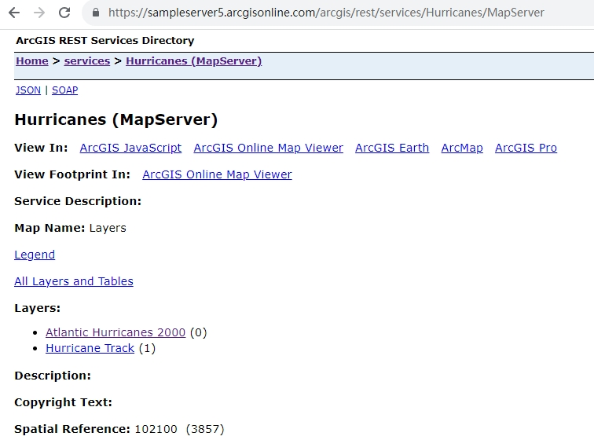
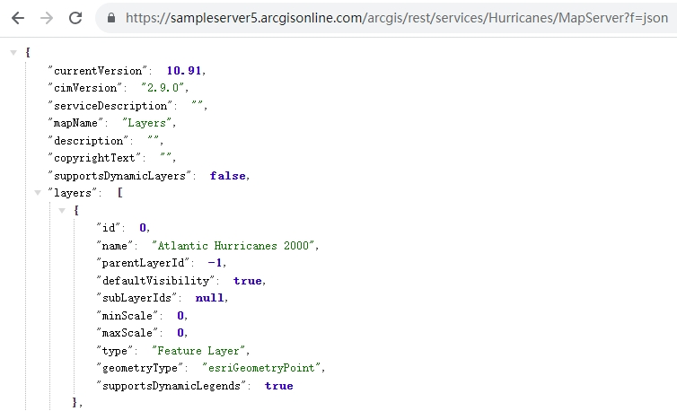
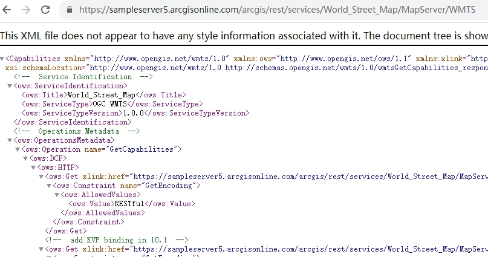
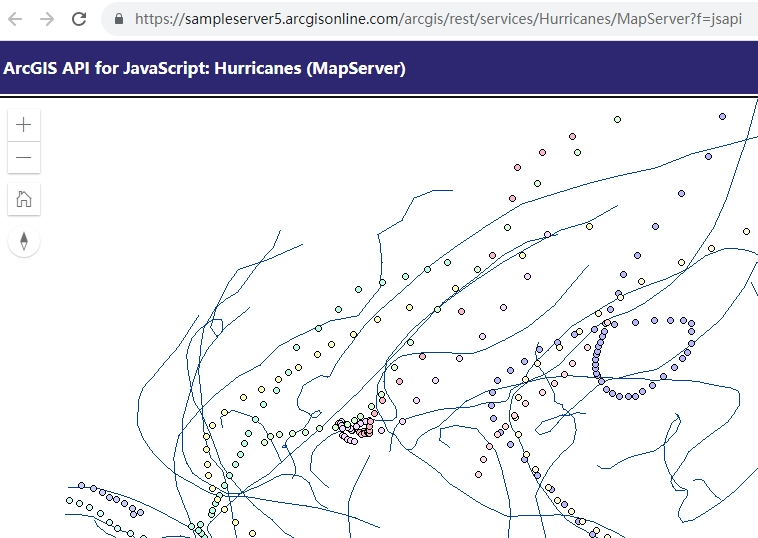
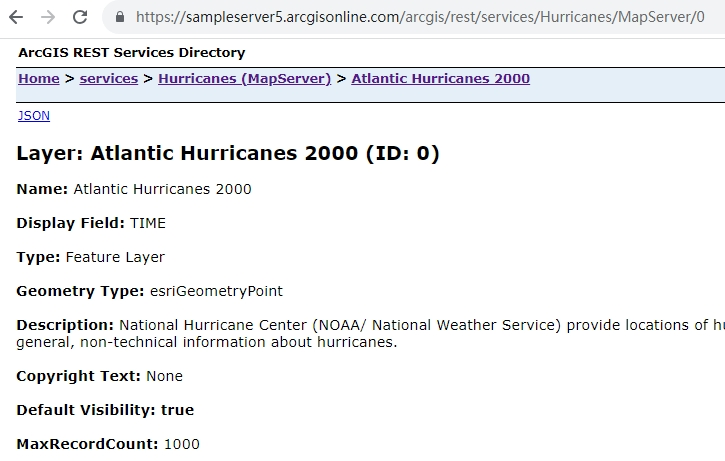
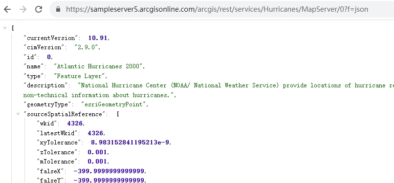
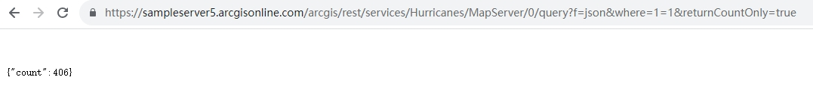
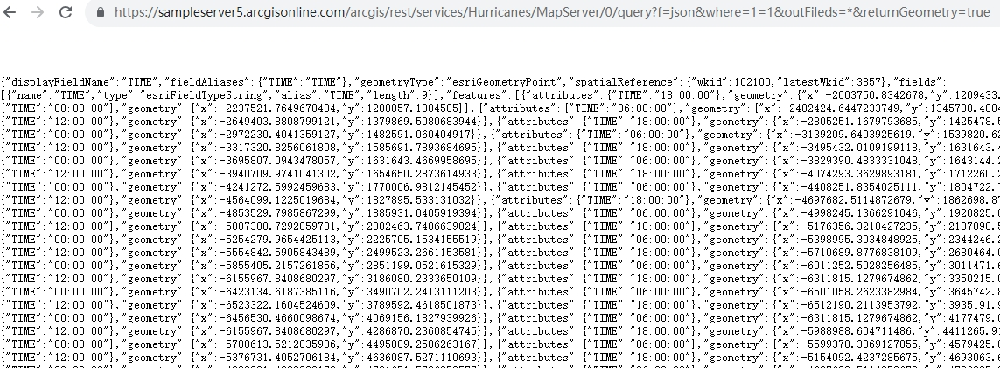

# ArcGIS 地图服务地址使用技巧

> 本文测试使用了两个 ArcGIS Online 公开的服务。
> 
> 服务地址：
> 
> (1) 动态地图服务地址：https://sampleserver5.arcgisonline.com/arcgis/rest/services/Hurricanes/MapServer
> 
> (2) 切片地图服务地址：https://sampleserver5.arcgisonline.com/arcgis/rest/services/World_Street_Map/MapServer

## 一、先认识一下服务地址的结构

ArcGIS 发布的服务地址都是有规律的。地图服务（切片地图服务、动态地图服务）地址的格式一般是：

```
https(http)://{域名（IP）}:{端口}/arcgis/rest/services/{文件夹名}/{服务名}/MapServer
```

## 二、查看服务描述信息

1. 打开服务地址可以查看排版好的服务描述信息。



2. 服务地址后面加 `?f=json` 可以查看 json 格式的服务描述信息。



3. 服务地址后面加 `/WMTS` 可以查看 OGC-WMTS 标准服务的描述信息。(只适用于切片服务)。



## 三、预览服务

服务地址后面加 `?f=jsapi` 即可预览服务。



## 四、查看图层信息

1. 服务地址后面加 `/图层ID` 即可查看排版好的图层信息。



2. 服务地址后面加 `/图层ID?f=json` 即可查看JSON格式的图层信息。



## 五、查询图层

1. 服务地址后面加 `/图层ID/query?f=json&where=1=1&returnCountOnly=true` 即可查询图层中的数据总条数。



2. 服务地址后面加 `/图层ID/query?f=json&where=1=1&outFileds=*&returnGeometry=true` 即可查询服务中的所有数据。（如果服务限制了一次查询只能返回的数据条数(默认是1000)的话，可能查不出所有数据）



参数解释：

| 参数名             | 含义       | 取值范围                  |
| --------------- | -------- | --------------------- |
| f               | 返回数据格式   | json、geojson、html等    |
| where           | 查询条件     | SQL条件。where=1=1表示查询所有 |
| returnCountOnly | 是否只返回数量  | true、false            |
| outFileds       | 返回的字段    | *或者逗号分隔的字段名           |
| returnGeometry  | 是否返回图形数据 | true、false            |

> 注：以上操作只适用于使用矢量数据发布的地图服务。

更复杂的查询如分组统计，此处不表，将会另写一篇。

（完）
