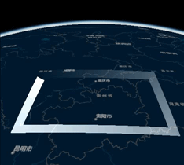

# 深度剖析 Cesium 使用 Primitive 实现动态线

## 背景

在 Cesium 中实现加载动态线的功能。会遇到两个问题，一个是使用 Entity 还是 Primitive；另一个是动态材质怎么实现。

第一个问题我选择 Primitive，因为测试发现数据量上万时 Entity 加载开始有明显的卡顿。第二个问题真不容易，因为可参考的资料不多，也没有人仔细讲原理。

## 一、先看一个示例
```html
<!DOCTYPE html>
<html>

<head>
  <meta charset="utf-8" />
  <meta name="viewport" content="initial-scale=1,maximum-scale=1,user-scalable=no" />
  <title>test</title>
  <link rel="stylesheet" href="//cdn.bootcdn.net/ajax/libs/cesium/1.97.0/Widgets/widgets.css" />

  <style>
    #cesiumContainer {
      height: 500px;
      width: 500px;
    }
  </style>

  <script src="//cdn.bootcdn.net/ajax/libs/cesium/1.97.0/Cesium.js"></script>

</head>

<body>
  <div id="cesiumContainer"></div>
  <script>
    const viewer = new Cesium.Viewer('cesiumContainer', {
      infoBox: false,
      timeline: false, // 禁用时间线控件
      animation: false, // 禁用动画控件
      homeButton: false, // 禁用主页控件
      geocoder: false, // 禁用地名搜索定位控件
      navigationHelpButton: false, // 禁用帮助控件
      sceneModePicker: false, // 禁用场景模式切换控件
      baseLayerPicker: false, // 禁用底图切换控件
    });

    viewer.imageryLayers.removeAll()
    // 禁用版权信息控件
    viewer._cesiumWidget._creditContainer.style.display = "none";

    // 添加底图
    viewer.imageryLayers.addImageryProvider(new Cesium.ArcGisMapServerImageryProvider({
      url: "//map.geoq.cn/arcgis/rest/services/ChinaOnlineStreetPurplishBlue/MapServer",
    }))

    // 设置视角
    viewer.camera.setView({
      "destination": {
        "x": -1909713.5752720681,
        "y": 6335549.864149072,
        "z": 2681442.787104271
      },
      "orientation": {
        "heading": 6.262743028873723,
        "pitch": -0.843392801136492,
        "roll": 0.000022777458393186123
      }
    })

    // 图形
    const geometryInstance = new Cesium.GeometryInstance({
      geometry: new Cesium.PolylineGeometry({
        positions: Cesium.Cartesian3.fromDegreesArray([
          102.536539, 30.301741,
          110.683813, 30.301741,
          110.683813, 26.037747,
          102.536539, 26.037747,
          102.536539, 30.301741
        ]),
        width: 20,
        vertexFormat: Cesium.PolylineMaterialAppearance.VERTEX_FORMAT,
      })
    })

    // 材质图片，此处用的是图片的base64编码
    // 原图片地址：https://www.freeimg.cn/i/2023/12/11/65767ffac43f3.png
    const image = 'data:image/png;base64,iVBORw0KGgoAAAANSUhEUgAAAgAAAAAgCAYAAABkS8DlAAAACXBIWXMAAAsTAAALEwEAmpwYAAAAIGNIUk0AAHolAACAgwAA+f8AAIDpAAB1MAAA6mAAADqYAAAXb5JfxUYAAADSSURBVHja7NYxEoUgDEDBYM39z2qHtZViwMFxt1FJnF/98ZXWWkRE7LWWOOt5Lsm9q/vsbu9Zdtazs/J19O5bs1XPZrwze/6V31zxbOZs1n905Wt2p3f25GzE7ohv6q3nLQCA3xEAACAAAAABAAAIAABAAAAAAgAAEAAAgAAAAAQAACAAAAABAAAIAABAAAAAAgAAEAAAgAAAAAQAACAAAEAAAAACAAAQAACAAAAABAAAIAAAAAEAAAgAAEAAAAACAAAQAACAAAAA8g4AAAD//wMA4WEFTJOT5UIAAAAASUVORK5CYII=';

    // 自定义材质
    const material = new Cesium.Material({
      translucent: true,
      fabric: {
        uniforms: {
          color: new Cesium.Color(1.0, 1.0, 1.0, 0.5),
          image: image,
          speed: 20,
        },
        source: `
            czm_material czm_getMaterial(czm_materialInput materialInput) {
              czm_material material = czm_getDefaultMaterial(materialInput);
              vec2 st = materialInput.st;
              float st_map_s = fract(st.s - speed * czm_frameNumber * 0.001);
              vec4 colorImage = texture2D(image, vec2(st_map_s, st.t));
              vec4 fragColor;
              fragColor.rgb = color.rgb / 1.0;
              material.alpha = colorImage.a * color.a;
              material.diffuse = fragColor.rgb;
              material.emission = fragColor.rgb;
              return material;
            }
          `,
      },
    });

    // 显示图形
    const primitive = new Cesium.Primitive({
      geometryInstances: [geometryInstance],
      appearance: new Cesium.PolylineMaterialAppearance({
        material: material
      }),
      asynchronous: false,
    });

    viewer.scene.primitives.add(primitive)
  </script>
</body>

</html>

```
以上这段代码主要参考了 [前端3D引擎-Cesium自定义动态材质](https://juejin.cn/post/7054970604104974344)。

代码可以直接运行，运行效果如下：



以上代码的主干逻辑还比较好理解，也有足够的资料可以参考。但是 fabric 的配置中有一串代码中的代码实在不容易理解。

```c
czm_material czm_getMaterial(czm_materialInput materialInput) {
  czm_material material = czm_getDefaultMaterial(materialInput);
  vec2 st = materialInput.st;
  float st_map_s = fract(st.s - speed * czm_frameNumber * 0.001);
  vec4 colorImage = texture2D(image, vec2(st_map_s, st.t));
  vec4 fragColor;
  fragColor.rgb = color.rgb / 1.0;
  material.alpha = colorImage.a * color.a;
  material.diffuse = fragColor.rgb;
  material.emission = fragColor.rgb;
  return material;
}
```

动态纹理的的难点就在这一段代码。难在哪里呢？

（1）这段代码使用了一种一般开发人员不熟悉的语言（GLSL, 全称 OpenGL Shading Language，是一种 C 风格的着色器语言）<sup>[4]</sup>;

（2）Cesium 官方对于这一块代码涉及的内容没有提供足够的参考资料。

（3）网上能查到的可参考的资料也不多。大多数博客都是给出代码，并不解释代码原理。

（4）即使仔细阅读每一句代码也不一定能理解为什么就这样变成了动态纹理。

这段代码称为「着色器代码」。

本文尝试对这段代码稍微解释仔细一点。

## 二、先从整体上看看

从整体上看，fabric.source 都会包含如下几行代码。
```c
czm_material czm_getMaterial(czm_materialInput materialInput) {
  czm_material material = czm_getDefaultMaterial(materialInput);

  return material;
}
```

这段代码有如下几个特点：

（1）以字符串的形式赋值给 `source` 属性。

（2）这段代码是一个函数定义，函数头固定为 `czm_material czm_getMaterial(czm_materialInput materialInput)`，函数返回值固定为 `czm_material` 对象，这个对象用于给图形上的一个像素着色。

（3）这段代码中 `czm_` 开头的变量类型和函数不属于 GLSL，是 Cesium 封装的。

（4）修改 `material` 变量就可以修改图形的纹理。

> 思考一个问题，这段代码会被调用多少次呢？
> 
> 调用一次只能设置一个像素的颜色，所以调用次数跟构成图形的像素数量有关。
> 
> 根据计算机图形学，我们在显示器上看到的画面是不断刷新的，即使是静态图片，显示时也在不断的刷新画面。刷新的单位是帧，刷新的频率叫帧率,帧率的意思表示画面每秒被绘制的次数。
> 
> 在 Cesium 程序中添加代码 `viewer.scene.debugShowFramesPerSencond = true` 即可看到帧率。 
> 
> 所以这段代码调用次数为 pixels(构成图形的像素数量) x fps（帧率） x seconds（图形显示的秒数）


## 三、细看每一句代码

这段着色器代码的难点之一在于有很多知识盲点，很多变量类型和函数都是陌生的。本节尝试一一解释。

```c
czm_material czm_getMaterial(czm_materialInput materialInput) {
  czm_material material = czm_getDefaultMaterial(materialInput);
  vec2 st = materialInput.st;
  float st_map_s = fract(st.s - speed * czm_frameNumber * 0.001);
  vec4 colorImage = texture2D(image, vec2(st_map_s, st.t));
  vec4 fragColor;
  fragColor.rgb = color.rgb / 1.0;
  material.alpha = colorImage.a * color.a;
  material.diffuse = fragColor.rgb;
  material.emission = fragColor.rgb;
  return material;
}
```

(1) `czm_material` 类型
Cesium 文档中对 `czm_material` 的解释是：

保存可用于设置光照的材质信息。由所有 `czm_getMaterial` 函数返回。<sup>[3]</sup>

`czm_material` 是着色器代码的返回值类型，是一个结构体<sup>[2]</sup>。
```c
struct czm_material
{
  vec3 diffuse; // 漫反射颜色，设置这个值会影响图形的颜色。
  float specular; // 镜面反射强度（高光）。
  float shininess; // 镜面反射的锐度（光泽度），值越高，会创建更小、更聚焦的镜面反射高光。
  vec3 normal; // 法线。
  vec3 emission; // 自发光颜色。
  float alpha; // 材质透明度，0.0表示完全透明；1.0表示完全不透明。
};
```
知道了 `czm_material`的数据结构，现在再看着色器代码中的 8-9 行 代码就容易理解了。
```c
material.alpha = colorImage.a * color.a; // 设置颜色透明度
material.diffuse = fragColor.rgb; // 设置漫反射颜色
material.emission = fragColor.rgb; // 设置自发光颜色
```

(2) `czm_materialInput` 类型

Cesium 文档中对 `czm_materialInput` 的解释是：

用作每种材质的 `czm_getMaterial` 函数的输入。<sup>[3]</sup>

`czm_materialInput` 是着色器代码的输入值类型，也是一个结构体<sup>[2]</sup>
```c
struct czm_materialInput
{
  float s; // 一维材质坐标
  vec2 st; // 二维材质坐标
  vec3 str; // 三维材质坐标
  mat3 tangentToEyeMatrix; // 片元切线空间到视点坐标系的转换矩阵，用于法线贴图、凹凸贴图等。 
  vec3 positionToEyeEC; // 从片元到视点之间的向量，用于反射、折射等计算。向量的模表示了从片元到视点的距离。
  vec3 normalEC; // 片元在视点空间的（标准化的）法向量，用于凹凸贴图、反射、折射等计算。
};
```
知道了`czm_materialInput`的数据结构，着色器代码中的第 3 行就可以看懂了。
```c
vec2 st = materialInput.st; // 获取二维材质坐标
```
(3) `czm_frameNumber` 变量

Cesium 文档中对 `czm_frameNumber` 的解释是：

表示帧编号的 GLSL uniform 变量。该变量每一帧都会自动递增。<sup>[3]</sup>

(4) GLSL 关键字

- `float` 变量类型：浮点数。
- `vec2` `vec3` `vec4` 变量类型：二维、三纬、四维浮点数向量。
- `floor` 内置函数：向下取整，即获取小于输入值的最大整数。
- `fract` 内置函数：`fract(x) === x - floor(x)` ，即获取输入值的小数部分，相当于对 1 其余。
- `texture2D` 内置函数：官方文档的解释为：使用纹理坐标在当前绑定的采样器的 2D 纹理中执行纹理查找<sup>[6]</sup>。可以简单理解为取色函数。在本文的示例代码中，使用到这个函数的代码为 `vec4 colorImage = texture2D(image, vec2(st_map_s, st.t));` ，这里的`texture2D` 函数输入值为图片（纹理采样器）和一个二维向量（纹理坐标），返回值为一个颜色值。

(5) 外部变量（统一变量）

在 GLSL 中一种变量类型叫做 uniform，可以翻译为统一变量，这种变量有三个特点：
a. 由应用程序通过 API 命令直接初始化，或由 OpenGL ES 间接初始化<sup>[6]</sup>；
b. 全局可用<sup>[6]</sup>；
c. 只读<sup>[6]</sup>。

本文示例的着色器代码中使用到的外部变量有 `color` 、`image`、`speed`、`czm_frameNumber`。

`fabric` 的 `uniforms` 属性下可以自定义外部变量（如本文示例中的 `color`、`image`、`speed`），`source` 值中的着色器代码可以直接取这些变量使用。

`czm_frameNumber` 是 Cesium 中定义的外部变量。

### 四、再看一遍代码

经过上一节的知识盲点梳理，此处可以加上一些注释

```c
czm_material czm_getMaterial(czm_materialInput materialInput) {
  // 获取系统默认的材质
  czm_material material = czm_getDefaultMaterial(materialInput);
  // 获取默认材质的纹理坐标
  vec2 st = materialInput.st;
  // 转换纹理坐标分量 st.s
  float st_map_s = fract(st.s - speed * czm_frameNumber * 0.001);
  // 从图片上取色
  vec4 colorImage = texture2D(image, vec2(st_map_s, st.t));
  vec4 fragColor;
  // 除 1.0 转为浮点数
  fragColor.rgb = color.rgb / 1.0;
  // 更新材质
  // 设置透明度
  // 此处透明度由图片颜色的透明度和外部变量color中的颜色透明度共同决定。
  material.alpha = colorImage.a * color.a;
  material.diffuse = fragColor.rgb; // 设置漫反射颜色，取自外部变量color
  material.emission = fragColor.rgb; // 设置自发光颜色，取自外部变量color
  return material;
}
```

> 纹理坐标 `st.s` 和 ` `st.t` 代表什么呢？
> 经过测试发现，在线图形中 s 表示沿线的方向，t 表示垂直于线的方向。 
> 
> 另外纹理坐标取值范围为 0~1，所以 st.s、st.t 取值范围为 0 ~ 1。

尽管每一个知识点都知道了，代码注释也加上了，有一个问题还是百思不得其解。动画是怎么出现的？为什么这样写代码纹理就会动了？

## 五、动画是怎么出现的

只要理解一句关键的代码就可以知道动画是怎么出现的。
```c
float st_map_s = fract(st.s - speed * czm_frameNumber * 0.001);
```

数学足够好或者熟悉图形学的人可能一下子就明白了。但是我当时想了半天也没想明白。

我当时思考过的问题有：

(1). `czm_frameNumber` 的取值范围是多少？

(2). `st_map_s` 的取值范围是多少？这个倒是不难想通，既然 fract 的功能是取小数部分，那么 `st_map_s` 的取值范围肯定是 0 ~ 1。

(3) 为什么改编 speed 的值就可以调整动画速度？

后来我想到了用数学工具把这句代码对应的数学公式画出来，看看随着 `czm_frameNumber` 的变化，`st_map_s` 怎么变化。

经过一番摸索，我最终选择使用 [Desmos]([Desmos | 图形计算器](https://www.desmos.com/calculator?lang=zh-CN)) 来作为研究工具。

代码中有三个变量 `st_map_s`、`st.s`、`czm_frameNumber` 。(注意 speed 一般是固定的值，在本文示例中 speed 为 20)。

要把代码转为公式，还需要说明一个问题。

一个动画中最重要的变量是时间，所以 `czm_frameNumber` 是关键的变量。`st.s` 可以暂时先定为一个常量。

于是公式可以写为：

```c
y = mod(0.5 - 0.02x, 1)
```


补充说明：

Cesium 自从 1.102 版本开始默认使用 WebGL2 作为渲染环境的上下文，此前的版本默认以 WebGL1 作为渲染环境的上下文。<sup>[7]</sup> WebGL2 中着色器代码语法标准为 GLSL ES 300, 而 WebGL1 中的着色器代码语法标准为 GLSL ES 100。<sup>[8]</sup>所以，如果 Cesium 版本不同，可能会导致从别处拷来的着色代码运行报错。

## 参考资料

[1] . [前端3D引擎-Cesium自定义动态材质](https://juejin.cn/post/7054970604104974344)

[2] . [Cesium Wiki Fabric](https://github.com/CesiumGS/cesium/wiki/Fabric)

[3] . [Cesium GLSL doc](https://cesium.com/downloads/cesiumjs/releases/b28/Documentation/czm_material.html)

[4] . [OpenGL Shading Language Wiki](https://www.khronos.org/opengl/wiki/OpenGL_Shading_Language)

[5] . [GLSL_ES_Specification_3.00](https://registry.khronos.org/OpenGL/specs/es/3.0/GLSL_ES_Specification_3.00.pdf)

[6] . [GLSL_ES_Specification 1.00)](https://www.khronos.org/files/opengles_shading_language.pdf)

[7] . [CesiumJS 1.102 changelog](https://github.com/CesiumGS/cesium/releases/tag/1.102)

[8] . [Using WebGL 2 by default - Cesium Community](https://community.cesium.com/t/using-webgl-2-by-default/21048)