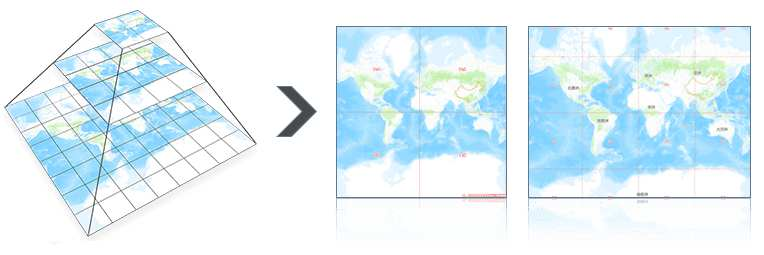
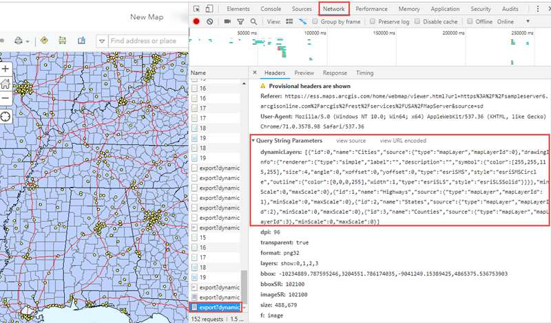
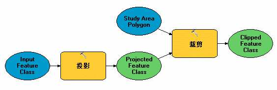
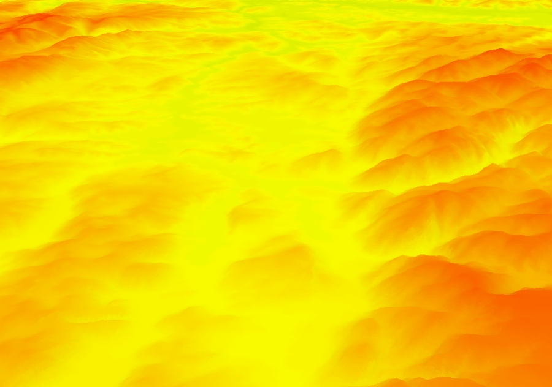

# 梳理常见的 GIS 服务类型在 OGC、ArcGIS、SuperMap 中的名称

## 背景

在开发地图功能的过程中，难免会遇到各种平台的各种类型的地图服务。OGC、ArcGIS、SuperMap 的服务我都有幸接触过一些，他们三个平台都有各自概念体系，偶尔也有些混乱的感觉。虽然 OGC 已经提供了一些标准，但是ArcGIS 和 SuperMap 都没有完全按照 OGC 标准来实现 GIS 服务，而是在支持 OGC 标准的同时基于 OGC 标准创造出了一套自己平台特有的服务类型。同一种类型的服务，在不同的平台会使用不同的名称，使用方法也有差异。为了理清一些概念，我试着梳理一下常见的 GIS 服务的在 OGC、ArcGIS、SuperMap 中的名称。

## 一、切片地图服务

- OGC: WMTS
- ArcGIS: 缓存地图服务
- SuperMap: 缓存地图服务

在介绍切片相关的操作时，ArcGIS 的文档中使用较多的词语是切片，SuperMap 的文档中使用较多的词语是瓦片。

## 二、动态地图服务

- OGC: WMS
- ArcGIS: 动态地图服务
- SuperMap: 动态地图服务

在 SuperMap中，动态地图服务也不算是完全的动态地图服务。调用服务时会生成切片缓存，下次查看地图上同一区域时将使用缓存。

## 三、数据服务

- OGC：WFS
- ArcGIS：要素服务
- SuperMap：数据服务

ArcGIS 和 SuperMap 中的动态地图服务都可以查询数据，只是不能编辑数据，可以算半个数据服务。

## 四、地理处理服务

- OGC: WPS
- ArcGIS: 地理处理服务
- SuperMap: 地理处理服务

## 五、三维场景服务

- OGC：————
- ArcGIS: 场景服务
- SuperMap: 三维服务

在三维场景服务方面，OGC 没有标准，不过有数据格式标准，分别是ArcGIS 的 i3S, Cesium 的 3D Tiles 。SuperMap 的 S3M 还没有被纳入 OGC。

## 六、三维地形服务

- OGC: ————
- ArcGIS: 高程影像服务
- SuperMap: 三维服务

在地形服务方面，OGC 没有相关的标准。

（完）