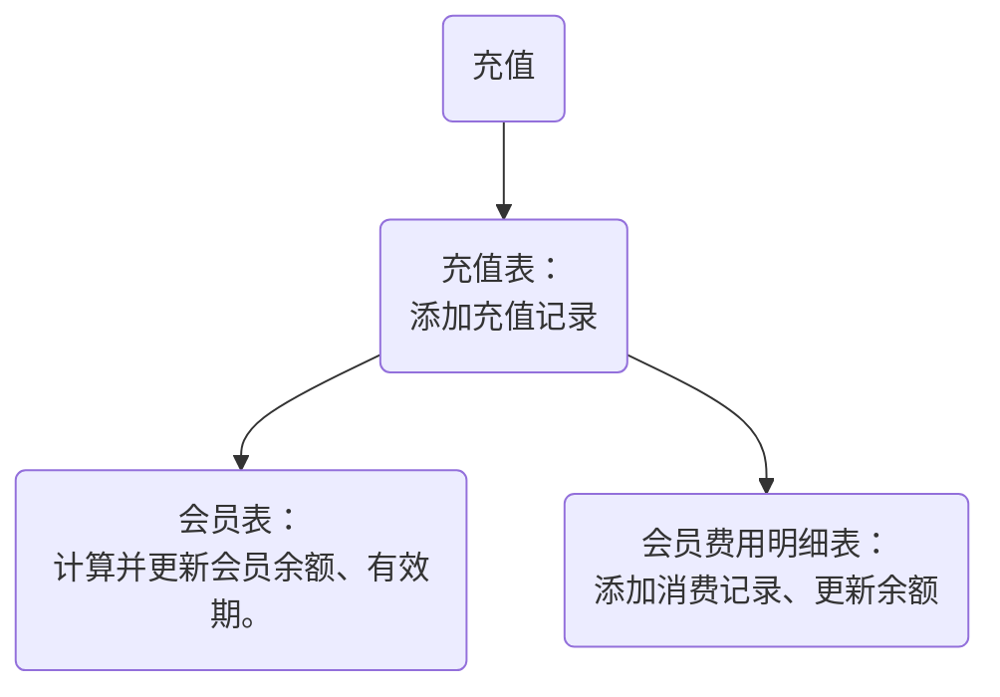
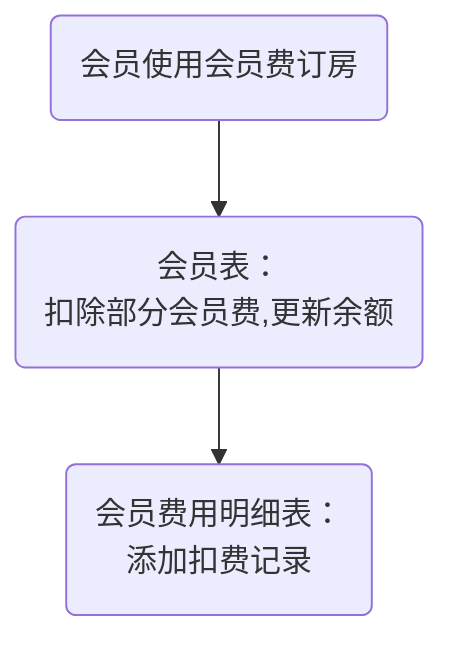
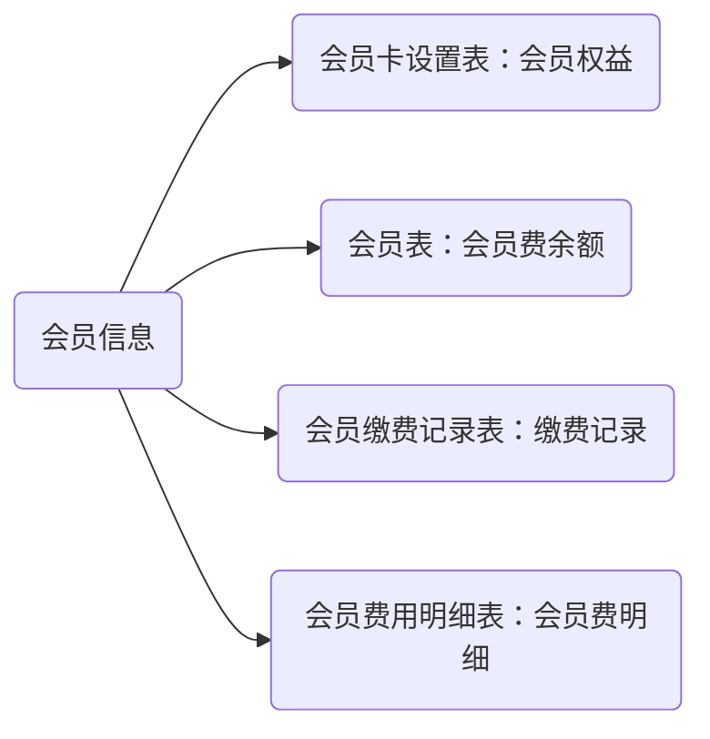
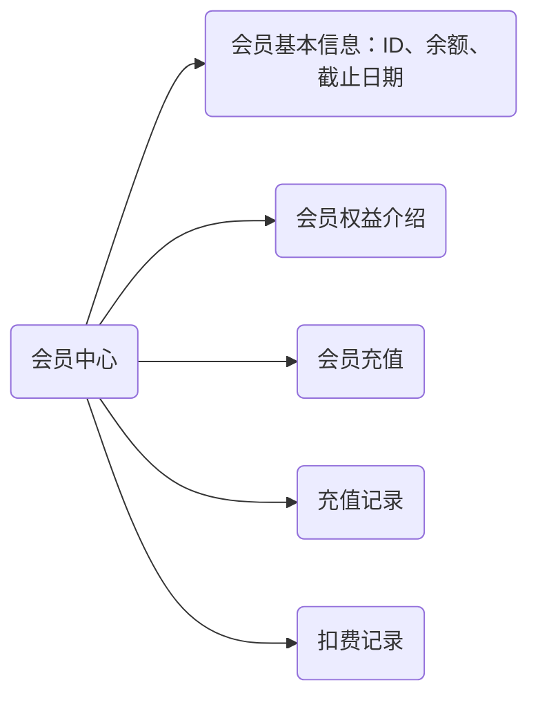
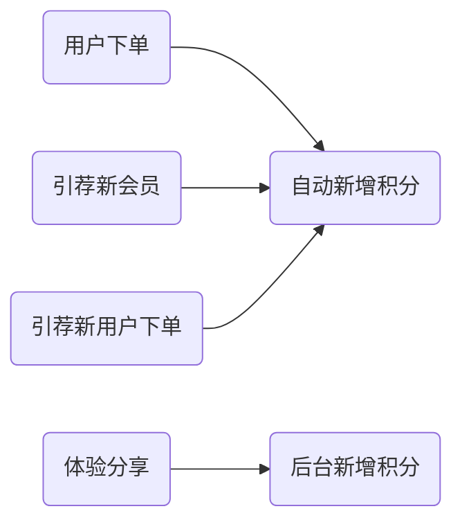
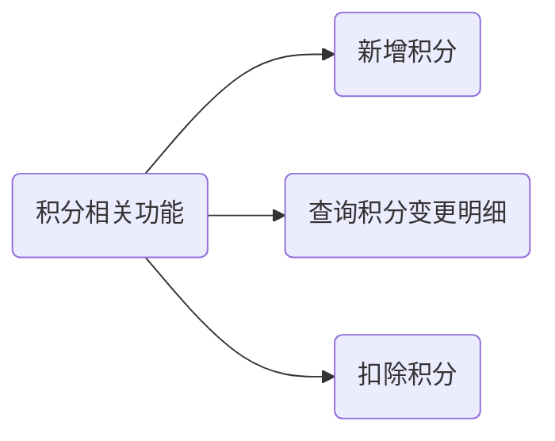

## 查阅房源
[ ] 房源明细
[ ] 房源地图 -> 房源明细
[ ] 微信注册
[ ] 微信登录
订房 -> [注册] -> [登录]
手机号登录 -
支付
我的订单
联系我们 -
个人中心 -> 我的订单
## 微信账号授权登录
- 编写微信账号授权获接口
- 编写微信手机号获取接口
- 缓存获取手机号和openid
- 使用手机号和openid登录接口

## 订单查看功能
- 查看订单界面

## 下单界面
## 房屋排期功能
- 日历展示功能。
- 排期查询接口。

## 付款功能
- 付款流程
- 微信订单生成接口
- 付款成功通知接口

下单->入住流程
退房流程x
客服（故障处理、答疑）

----
订单详细信息 - 
订单保留30分钟支付 -
房屋位置按钮改为 【导航】 -
房屋排期网页版
日期边界问题
申请位置接口
通知测试
建消息表
编写通知接口
订单成功 -> 订单详情页 -> []
入住天数
订单号

-------------------------------
订单复核
  订单核实确认（网页）-
  发送通知（后台接口）-
订单通知
  配置微信小程序通知功能（微信小程序后台）-
  编写微信小程序消息通知接口（后台接口）-
  请求消息通知权限（微信小程序）-
订单评论
  评论数据表：新增接口、查询接口、删除接口（后台）
  填写评论（微信小程序）-
  删除评论（微信小程序））
  查询评论（微信小程序）-

--------------------------------
## 会员业务设计
  会员缴费表：新增接口、查询接口、删除接口（后台）
  缴费、续费（微信小程序）
  会员展示（微信小程序）
  付款时优惠方案选择、算价（微信小程序）
  会员管理：查询、统计会员（网页）
- [-] 会员卡设置表
 - card_id 会员卡 ID
 - card_price 会员卡年费
 - card_cover 会员卡封面
 - card_type 会员卡类型
 - card_rights 会员卡权益
 - card_name 会员卡名称
  
- [-] 会员缴费表 lvj_vip_payments
 - ID
 - 用户 ID: user_id
 - 缴费年数
 - 缴费金额
 - 截止有效期
 - 缴费时间

- [-] 会员费明细表 vip_banlance_records
  - 会员编号
  - 变更时间
  - 变动金额
  - 余额
  - 变动原因：订房、续费

- [-] 会员表
  - vip_id: 会员 ID
  - card_id
  - user_id
  - create_time
  - start_time
  - end_time
  - balance

```sql
create table lvj_vip_payments (
    id            bigint(20)      not null auto_increment    comment 'ID',
    user_id               bigint(20)       not null   comment '用户ID',
    payment_years         smallint       not null   comment '缴费年数',
    amount                decimal(8,2)       not null   comment '缴费金额',
    out_trade_no          varchar(32)        not null   comment '交易编号'
    trade_state           varchar(32)        not null   comment '交易状态（未支付，已支付）'
    start_time            datetime     not null   comment '会员开始日期',
    end_time              datetime     not null   comment '会员截止日期',
    create_time          datetime        not null    comment '创建时间',
    primary key (comment_id)
  ) engine=innodb auto_increment=100 comment = '会员缴费表';
  会员卡配置表
  create table lvj_vip_card (
    card_id            bigint(20)      not null auto_increment    comment 'ID',
    card_name         varchar(16)     not null comment '会员卡名称', 
    year_price        decimal(8,2)       not null   comment '年费',
    card_cover         varchar(128)        not null   comment '会员卡封面',
    card_type          varchar(32)        not null   comment '会员类型',
    card_rights        varchar(1024)     not null   comment '会员权益说明',
    create_time        datetime        not null    comment '创建时间',
    create_by         varchar(64)     default ''   comment '创建者',
    update_by         varchar(64)     default ''   comment '更新者',
    update_time        datetime                    comment '更新时间'
    primary key (card_id)
  ) engine=innodb auto_increment=100 comment = '会员卡表';
;  会员表
  create table lvj_vip_user (
    vip_id            bigint(20)      not null    auto_increment    comment '会员ID(会员卡编号)',
    card_id           bigint(20)      not null    comment '会员卡ID',
    user_id           bigint(20)      not null    comment '用户ID',
    create_time       datetime        not null    comment '创建时间',
    start_time        datetime        not null    comment  '开始时间',
    end_time          datetime        not null    comment '结束时间',
    balance           decimal(8,2)    not null    comment '余额',
    primary key (vip_id)
  ) engine=innodb auto_increment=100 comment = '会员表';
;会员费用明细表
create table lvj_vip_user (
  id                bigint(20)      not null    comment 'ID',
  user_id           bigint(20)      not null    comment '用户ID',
  create_time       datetime        not null    comment '发生时间',
  start_time        datetime        not null    comment  '开始时间',
  end_time          datetime        not null    comment '结束时间',
  balance           decimal(8,2)    not null    comment '余额',
  primary key (vip_id)
) engine=innodb auto_increment=100 comment = '会员费用明细表';
```

## 会员卡配置 ✔
  接口
    更新会员卡信息 [-]
    查询会员卡 [-]
  会员卡配置界面（网页）
    查询会员卡 [-]
    更新会员卡 [-]
## 会员账号管理 ✔
  接口
    新增会员-后台用
    查询会员列表
    根据用户名、电话、会员Id查询会员
    更新余额、起止时间-后台用
  界面-网页
    查询会员列表
    查看会员详情
  界面-小程序
    查询会员详情
## 会员卡消费表 ✔
  接口
    新增消费记录-后台用
    查询消费记录
## 会员卡充值（缴费）表 ✔
  接口
    新增充值记录
    查询充值记录

## 会员充值逻辑



## 会员费支出逻辑



## 会员信息查询逻辑




## 会员中心[客户端]


-----------------------------
VIP 用户积分明细表 lvj_user_points
- ID
- 用户ID user_id
- 新积分 new_points
- 积分来源 points_source 0: 邀请新用户注册 1: 订房
- 来源明细 points_detail
- 创建日期

```sql
create table lvj_vip_user_points (
    id                bigint(20)      not null    comment 'ID',
    user_id           bigint(20)      not null    comment '用户ID',
    create_time       datetime        not null    comment '记录时间',
    new_points        mediumint       not null    comment '变动数量',
    balance           mediumint       not null    comment '积分余额',
    points_source     char(1)         not null    comment '积分来源：0 订房、2 引荐新会员、3 体验分享、4、引荐新用户下单',
    points_detail     varchar(256)    null  comment '来源说明',
    primary key (id)
  ) engine=innodb auto_increment=100 comment = '会员积分明细表';
```

VIP用户表
+ 积分 points




- 积分相关功能


++++++++++++++++++++++++++++++++++++++++
————————————————————————————————————————

2024-06-24 会议
```js
一、软件开发进展汇报

  1、会员费缴纳功能支持缴纳一年以上的。

  2、会员费每次只能抵扣年费的 1/12，并且双倍抵扣。
  
  3、支持积分抵扣房费。每次只能抵扣 200 分。
  
  4、添加了会员使用说明界面。
  
  5、添加了关注我们界面。


X
  1、每月只能抵扣一次
  2、订房送积分。

1、建议会员费只能交一年。
2、用户不能退出。
3、分享给别人后我的信息还在。
4、首页每次打开都是一样的房源。
5、建议支持按地区、按价格搜索功能。
```

# 支持设置会员价和挂牌价

## 2024-06-26
```sql
alter table lvj_house add column vip_day_rent decimal(10, 2) NOT NULL default 100 comment '会员订房价格（元/晚）';
```
```
```
# 2024-06-28 添加省市、餐食提供字段
```sql
alter table lvj_house add column province varchar(16) NULL comment '所在省份';
alter table lvj_house add column city varchar(16) NULL comment '所在市';
alter table lvj_house add column food_service char(1) NULL comment '餐食供应';
alter table lvj_house add column available_service varchar(16) NULL comment '可提供的服务';
```

小程序新版本未生效问题。✔

## 2024-06-30 会员实名信息填写
```sql
alter table lvj_user add column id_card_number varchar(32) NULL comment '身份证号';
alter table lvj_user add column name varchar(8) NULL comment '姓名';
```

# 2024-07-01 导出会员清单
```sql
select 
       user.user_id "会员ID",
       user.sex "性别",
       user.name "姓名",
       user.id_card_number "身份证号",
       user.phonenumber "电话号码",
       vip.create_time "加入时间"
from lvj_vip_user vip
     left join lvj_user user on vip.user_id = user.user_id;
```

# 2024-07-02 添加房源排序功能
```sql
alter table lvj_house add column sort_index smallint NOT NULL default 200 comment '排序索引';
```

# 2024-07-06 添加城市列表接口


# 2024-07-09 支持按照日期设置放假

## 房价日历表

```sql 
create table lvj_house_calendar_price (
    id          bigint(20)      not null  auto_increment   comment 'ID',
    house_id    bigint(20)      not null    comment '房源ID',
    vip_price   decimal(10,2)   not null    comment 'VIP价格',
    price       decimal(10, 2)  not null    comment '挂牌价',
    price_date  datetime        not null    comment '价格日期',
    create_time datetime        not null    comment '创建日期',
    update_time datetime        null        comment '更新日期',
    primary key (id)
  ) engine=innodb auto_increment=100 comment = '房价日历表';
```

## 房屋节假日价格表

```sql
create table lvj_house_holiday_price (
  id                bigint(20)      not null  auto_increment   comment 'ID',
  house_id          bigint(20)      not null    comment '房源ID',
  workday_vip_price decimal(10,2)   not null    comment '工作日VIP价格',
  workday_price     decimal(10, 2)  not null    comment '工作日挂牌价', 
  weekend_vip_price decimal(10,2)   not null    comment '周末VIP价格',
  weekend_price     decimal(10, 2)  not null    comment '周末挂牌价', 
  holiday_vip_price decimal(10,2)   not null    comment '节假日VIP价格',
  holiday_price     decimal(10, 2)  not null    comment '节假日挂牌价', 
  create_time     datetime          not null    comment '创建日期',
  update_time     datetime          null        comment '更新日期',
  primary key (id)
) engine=innodb auto_increment=100 comment = '房屋节假日价格表';
```

设置节假日价格：查询、设置
按日期设置价格：查询、设置、查节假日
查询房价
计算房价
# 2024-07-10 设置关房后仍然可订房


# 2024-07-15 实名信息录入功能优化


# 2024-07-19 小程序管家功能 v1
代理商表
```sql
create table lvj_agent (
    agent_id          bigint(20)      not null  auto_increment   comment 'ID', 
    user_id     bigint(20)      not null  comment '用户ID, 关联lvj_user表',
    password    varchar(64)     not null  comment '密码',
    create_time datetime          not null    comment '创建日期',
    update_time datetime          null        comment '更新日期',
    primary key (agent_id)
  ) engine=innodb auto_increment=100 comment = '代理商表';
```
管家表
```sql
create table lvj_housekeeper (
    housekeeper_id          bigint(20)      not null  auto_increment   comment 'ID', 
    user_id     bigint(20)      not null  comment '用户ID, 关联lvj_user表',
    password    varchar(64)     not null  comment '密码',
    create_time datetime          not null    comment '创建日期',
    update_time datetime          null        comment '更新日期',
    primary key (housekeeper_id)
  ) engine=innodb auto_increment=100 comment = '管家表';
```
代理商角色表
```sql
create table lvj_agent_role (
    agent_id   bigint(20)      not null  comment '代理商id', 
    role_id    bigint(20)      not null  comment '角色id'
  ) engine=innodb comment = '代理商角色表';
```
管家角色表
```sql
create table lvj_housekeeper_role (
    housekeeper_id   bigint(20)      not null  comment '管家id', 
    role_id    bigint(20)      not null  comment '角色id'
  ) engine=innodb comment = '管家角色表';
```
管家房源表
```sql
create table lvj_housekeeper_house (
    housekeeper_id   bigint(20) not null  comment '管家id', 
    house_id    bigint(20)      not null  comment '房源id'
  ) engine=innodb comment = '管家房源表';
```

代理商房源表
```sql
create table lvj_agent_house (
    agent_id   bigint(20) not null  comment '代理商id', 
    house_id    bigint(20)      not null  comment '房源id'
  ) engine=innodb comment = '代理商房源表';
```

# 小院整租会员充值功能 07-23

小院会员卡配置表
```sql
create table lvj_yard_vip_card (
    card_id     bigint(20)      not null auto_increment   comment 'ID',
    card_name   varchar(16)     not null comment '会员卡名称', 
    card_price  decimal(8,2)    not null   comment '会员卡价格',
    deduction_amount  decimal(8,2)    not null comment '可抵额度',
    yard_id           varchar(32)     not null comment '关联小院ID',
    rent_times        tinyint         not null comment '包场次数', 
    card_rights       varchar(1024)   not null comment '会员卡权益说明',
    status        char(1)     not null comment '状态：0 正常 1 注销',   
    create_time   datetime    not null    comment '创建时间',
    create_by     varchar(64) default ''   comment '创建者',
    update_by     varchar(64) default ''   comment '更新者',
    update_time   datetime    null         comment '更新时间',
    primary key (card_id)
  ) engine=innodb auto_increment=100 comment = '小院会员卡表';
```
小院会员账号表
```sql
create table lvj_yard_vip_user (
    vip_id  bigint(20)  not null auto_increment  comment '会员ID',
    card_id bigint(20)  not null    comment '会员卡ID',
    user_id bigint(20)  not null    comment '关联lvj_user 表的user_id',
    create_time   datetime        not null    comment '创建时间',
    start_time    datetime        not null    comment  '开始时间',
    end_time      datetime        not null    comment '结束时间',
    balance       decimal(8,2)    not null    comment '余额',
    left_times    tinyint         not null    comment '剩余次数',
    primary key (vip_id)
  ) engine=innodb auto_increment=100 comment = '小院会员账号表';
```
小院会员充值记录表
```sql
create table lvj_yard_vip_payments (
    id       bigint(20)  not null auto_increment  comment 'ID',
    card_id  bigint(20)  not null    comment '关联lvj_yard_card',
    user_id  bigint(20)  not null    comment '关联lvj_user',
    amount   decimal(8, 2) not null  comment '缴费金额',
    deduction_amount   decimal(8, 2) not null  comment '可抵金额',
    out_trade_no       varchar(32) not null comment '交易编号',
    trade_state    varchar(32) not null DEFAULT '未支付' comment '交易状态（未支付，已支付）',
    create_time datetime not null comment '创建时间',
    primary key (id)
  ) engine=innodb auto_increment=100 comment = '小院会员充值记录表';
```
小院会员余额变更记录表
```sql
CREATE TABLE lvj_yard_vip_banlance_records  (
    id bigint(20)         not null auto_increment comment 'ID',
    user_id bigint(20)    not null comment '关联lvj_user表',
    amount decimal(8, 2)  not null comment '变动金额',
    create_time datetime  not null comment '发生时间',
    balance decimal(8, 2) not null comment '余额',
    remark varchar(32)    not null comment '备注',
    primary key (id)
  )  engine=innodb auto_increment=100 comment = '小院会员余额变更记录表';
```

[-] 小院会员显示
[-] 小院会员充值界面
[] 小院会员配置界面

# 2024-07-28 小院信息录入

小院信息表
```sql
CREATE TABLE lvj_yard  (
    yard_id bigint(20) NOT NULL AUTO_INCREMENT COMMENT '小院ID',
    yard_name varchar(30) CHARACTER SET utf8mb4 COLLATE utf8mb4_bin NOT NULL COMMENT '小院名称',
    yard_advantage varchar(50) CHARACTER SET utf8mb4 COLLATE utf8mb4_bin NULL DEFAULT NULL COMMENT '推荐理由',
    security_facility varchar(50) CHARACTER SET utf8mb4 COLLATE utf8mb4_bin NULL DEFAULT NULL COMMENT '安保设施',
    outdoor_facility varchar(50) CHARACTER SET utf8mb4 COLLATE utf8mb4_bin NULL DEFAULT NULL COMMENT '室外设施',
    indoor_facility varchar(50) CHARACTER SET utf8mb4 COLLATE utf8mb4_bin NULL DEFAULT NULL COMMENT '室内设施',
    latitude decimal(9, 6) NULL DEFAULT NULL COMMENT '纬度',
    longitude decimal(9, 6) NULL DEFAULT NULL COMMENT '经度',
    address varchar(100) CHARACTER SET utf8mb4 COLLATE utf8mb4_bin NULL DEFAULT NULL COMMENT '地址',
    photos varchar(2000) CHARACTER SET utf8mb4 COLLATE utf8mb4_bin NULL DEFAULT NULL COMMENT '环境照片',
    videos varchar(1000) CHARACTER SET utf8mb4 COLLATE utf8mb4_bin NULL DEFAULT NULL COMMENT '视频',
    floor_plan varchar(2000) CHARACTER SET utf8mb4 COLLATE utf8mb4_bin NULL DEFAULT NULL COMMENT '户型图',
    province varchar(16) CHARACTER SET utf8mb4 COLLATE utf8mb4_bin NULL DEFAULT NULL COMMENT '所在省份',
    city varchar(16) CHARACTER SET utf8mb4 COLLATE utf8mb4_bin NULL DEFAULT NULL COMMENT '所在市',
    food_service char(1) CHARACTER SET utf8mb4 COLLATE utf8mb4_bin NULL DEFAULT NULL COMMENT '餐食供应',
    available_service varchar(16) CHARACTER SET utf8mb4 COLLATE utf8mb4_bin NULL DEFAULT NULL COMMENT '可提供的服务',
    room_num smallint NOT NULL DEFAULT 1 COMMENT '总房间数',
    bedchamber_num smallint NOT NULL DEFAULT 0 COMMENT '卧室数量',
    total_area decimal(6, 2) NOT NULL DEFAULT 0 COMMENT '总面积，单位：平方米',
    yard_area decimal(6, 2) NOT NULL DEFAULT 0 COMMENT '院子面积，单位：平方米',
    house_area decimal(6, 2) NOT NULL DEFAULT 0 COMMENT '房屋建筑面积，单位：平方米',
    house_type char(1) NOT NULL DEFAULT '0' COMMENT '房屋类型：0楼房，1别墅，2宅院',
    farmland_area decimal(6, 2) NOT NULL DEFAULT 0 COMMENT '可耕种土地面积，单位：平方米',
    farmland_distance decimal(6, 2) NOT NULL DEFAULT 0 COMMENT '可耕种土地距离，单位米',
    parking_available char(1) NOT NULL DEFAULT '0' COMMENT '是否可停车：0自带停车场，1不可停车，2附近有停车场',
    heating_method char(1) NOT NULL DEFAULT '0' COMMENT '取暖方式：0用电，1烧煤，2暖气，3柴火',
    wc_number smallint NOT NULL DEFAULT 0 COMMENT '卫生间数量',
    house_wc_number smallint NOT NULL DEFAULT 0 COMMENT '有卫生间的房间数量',
    status char(1) CHARACTER SET utf8mb4 COLLATE utf8mb4_bin NULL DEFAULT '0' COMMENT '小院状态（0营业中 1使用中 2维护中）',
    create_by varchar(64) CHARACTER SET utf8mb4 COLLATE utf8mb4_bin NULL DEFAULT '' COMMENT '创建者',
    create_time datetime NULL DEFAULT NULL COMMENT '创建时间',
    update_by varchar(64) CHARACTER SET utf8mb4 COLLATE utf8mb4_bin NULL DEFAULT '' COMMENT '更新者',
    update_time datetime NULL DEFAULT NULL COMMENT '更新时间',
    sort_index smallint NOT NULL DEFAULT 200 COMMENT '排序索引',
    remark varchar(255) CHARACTER SET utf8mb4 COLLATE utf8mb4_bin NULL DEFAULT NULL COMMENT '备注',
    del_flag char(1) CHARACTER SET utf8mb4 COLLATE utf8mb4_bin NULL DEFAULT '0' COMMENT '删除标志（0代表存在 2代表删除）',
    PRIMARY KEY (`yard_id`) USING BTREE
  ) ENGINE = InnoDB AUTO_INCREMENT = 100 CHARACTER SET = utf8mb4 COLLATE = utf8mb4_bin COMMENT = '小院信息表';
  
```

小院-民宿关系表

```sql
create table lvj_yard_house (
    yard_id   bigint(20)   not null  comment '小院id', 
    house_id  bigint(20)   not null  comment '房屋id'
  ) engine=innodb comment = '小院-民宿关系表';
```

小院房态表
```sql

CREATE TABLE lvj_yard_switch (
  id bigint(20) NOT NULL AUTO_INCREMENT COMMENT 'ID',
  yard_id bigint(20) NOT NULL COMMENT '小院ID',
  switch_status char(1) CHARACTER SET utf8mb4 COLLATE utf8mb4_bin NOT NULL COMMENT '小院开关状态：0 开房，1关房',
  switch_date datetime NOT NULL COMMENT '房态日期',
  create_time datetime NOT NULL COMMENT '创建时间',
  create_by varchar(64) CHARACTER SET utf8mb4 COLLATE utf8mb4_bin NOT NULL COMMENT '创建人',
  update_time datetime NULL DEFAULT NULL COMMENT '更新时间',
  update_by varchar(64) CHARACTER SET utf8mb4 COLLATE utf8mb4_bin NULL DEFAULT NULL COMMENT '更新人',
  PRIMARY KEY (id) USING BTREE
) ENGINE = InnoDB AUTO_INCREMENT = 115 CHARACTER SET = utf8mb4 COLLATE = utf8mb4_bin COMMENT = '小院房态表' ROW_FORMAT = Dynamic;

```

小院整租价格日历表
```sql

CREATE TABLE lvj_yard_calendar_price  (
  id bigint(20) NOT NULL AUTO_INCREMENT COMMENT 'ID',
  yard_id bigint(20) NOT NULL COMMENT '小院ID',
  vip_price decimal(10, 2) NOT NULL COMMENT 'VIP价格',
  price decimal(10, 2) NOT NULL COMMENT '挂牌价',
  price_date datetime NOT NULL COMMENT '价格日期',
  create_time datetime NOT NULL COMMENT '创建日期',
  update_time datetime NULL DEFAULT NULL COMMENT '更新日期',
  PRIMARY KEY (id) USING BTREE
) ENGINE = InnoDB AUTO_INCREMENT = 107 CHARACTER SET = utf8mb4 COLLATE = utf8mb4_bin COMMENT = '小院整租价格日历表' ROW_FORMAT = Dynamic;

```

小院整租节假日价格表
```sql

CREATE TABLE `lvj_yard_holiday_price`  (
  `id` bigint(20) NOT NULL AUTO_INCREMENT COMMENT 'ID',
  `yard_id` bigint(20) NOT NULL COMMENT '小院ID',
  `workday_vip_price` decimal(10, 2) NOT NULL COMMENT '工作日VIP价格',
  `workday_price` decimal(10, 2) NOT NULL COMMENT '工作日挂牌价',
  `weekend_vip_price` decimal(10, 2) NOT NULL COMMENT '周末VIP价格',
  `weekend_price` decimal(10, 2) NOT NULL COMMENT '周末挂牌价',
  `holiday_vip_price` decimal(10, 2) NOT NULL COMMENT '节假日VIP价格',
  `holiday_price` decimal(10, 2) NOT NULL COMMENT '节假日挂牌价',
  `create_time` datetime NOT NULL COMMENT '创建日期',
  `update_time` datetime NULL DEFAULT NULL COMMENT '更新日期',
  PRIMARY KEY (`id`) USING BTREE
) ENGINE = InnoDB AUTO_INCREMENT = 106 CHARACTER SET = utf8mb4 COLLATE = utf8mb4_bin COMMENT = '小院整租节假日价格表' ROW_FORMAT = Dynamic;

```

# 订单表添加小院 id 字段
```sql
alter table lvj_order modify house_id bigint(20) NULL;
alter table lvj_order add column yard_id bigint(20) NULL comment '小院id';
alter table lvj_order add column guests_number tinyint NULL comment '入住人数';
alter table lvj_order add column total_price decimal(10, 2) NULL comment '总价';
```

# 折扣记录表添加字段
```sql
alter table lvj_coupon_records add column deducted_times tinyint NULL comment '扣除次数';
```

# 手动添加伴湖居会员
```sql
-- 添加付款记录

insert into lvj_yard_vip_payments (card_id, user_id, amount, deduction_amount, out_trade_no, trade_state, create_time) values (100, 256, 980, 1620, 'xxzf', '已支付', '2024-08-06 00:00:00');

-- 添加会员账号
insert into lvj_yard_vip_user (card_id, user_id, create_time, start_time, end_time, balance, left_times) value(100, 256, '2024-08-06 00:00:00', '2024-08-06 00:00:00', '2025-08-06 00:00:00', 1620, 1);

-- 添加余额变更记录
insert into lvj_yard_vip_banlance_records (user_id, amount, create_time, balance, remark, left_times) values (256, 1620, '2024-08-06 00:00:00', 1620, '充值', 1);

```

# 手动抵扣会员费
```sql
-- 添加订单

-- 添加抵扣记录

-- 添加余额变更记录

-- 更新会员余额
```

# 小院增加床位数量字段
```sql
alter table lvj_yard add column bed_number tinyint default 1 comment '床位数量';
```

小院房态管理
同步关房
同步运维

小院房价日历

小院整租抵扣

小院订房抵扣

小院订单查看
# 2024-08-19

[-] 民宿会员每月只能抵扣一次。
[] 开关房备注功能。
[] 关房 -> 已被预定功能
[] 评论功能优化。
[-] 抵扣界面优化。
[] 李致兰会员无法抵扣功能。
[] 视频功能优化。
[] 首页优化。
[] 首页搜索支持带地址搜索。
[] 添加不接待宠物标签。
[] 继续支付按钮移动到外层。

**小院会员卡技术逻辑改造**

## 小程序优先使用 openid 登录

小院涨价后旧会员卡包场如何计算费用？
新旧会员卡一起使用时怎么计算？
会员卡被用来订房间之后再包场如何计算费用？补差价如何补。

# 小院会员卡增加 m_price 字段

```sql
alter table lvj_yard_vip_card add column m_price decimal(10, 2) default 1748 comment '小院价格';
```

# 管家数据配置 v2
```sql
alter table lvj_user add column category char(1) default '1' comment '用户类别，1：小程序用户、2：关联后台管理的用户';

alter table lvj_user add column is_applying char(1) default '0' comment '用户申请状态，0：未申请、1：正在申请成为房屋管家';

alter table lvj_user add column admin_user_id bigint(20) default NULL comment '关联管家user_id, 见表sys_user';
```
# BUGFIX
1. 小程序看不到户型图。✔
2. 第二页录入的房源，在房源地图上未显示，在小程序端未能展示出来。✔
3. 下单页面价格显示方式优化。（小程序）✔
4. 房源录入界面优化。（后台）
5. 房屋详情页面不能后退。（小程序）✔
6. about 页面连接无法单独打开（网页）

# FEATURE
1. 支持设置房源的至少订房天数。
2. 定时检查未付款订单。✔
3. 小院信息录入、查看、更新、订房。
4. 支持上传房源视频、播放视频。✔ 06-10
5. 房源信息支持填写：可提供的服务、餐食提供、付款方式。✔
6. 下拉刷新。✔ 06-09
7. 放大查看图片。✔
8. 同一个点多个房屋时，弹窗支持翻页。✔
9. 会员价格设置。✔
10. 会员费抵扣：每月限制一次，每次抵扣：会员年费/12 * 2。

1.管家端，订房通知？确认功能。

2.最小订房天数设置功能。

3.地图增加缩放控制操作图标。✔

4.地图增加显示我的位置图标

5.增加视频上传功能。 ✔

6.小院展示，预订。

# 小程序管家端
1、优先做订房通知功能。

# 数据库
- [ ] 17:06 
	> 模型向下平移
	
	```js
	const origin = tileset.boundingSphere.center;  
	const m = Cesium.Transforms.eastNorthUpToFixedFrame(origin);//获取到以模型中心为原点,Z轴垂直地表的局部坐标系，以矩阵表示，此矩阵为将局部坐标系变换到世界坐标系的变换矩阵  
	//平移  
	const tempTranslation = new Cesium.Cartesian3(0, 0, -250);//平移向量  
	const offset = Cesium.Matrix4.multiplyByPoint(m, tempTranslation, new Cesium.Cartesian3(0, 0, 0));//局部坐标中（tx,ty,tz)在世界坐标系中位置  
	const translation = Cesium.Cartesian3.subtract(offset, origin, new Cesium.Cartesian3());//终点世界坐标减去原点世界坐标得到世界坐标系下平移向量  
	tileset.modelMatrix = Cesium.Matrix4.fromTranslation(translation);
	```
	
	#gis  