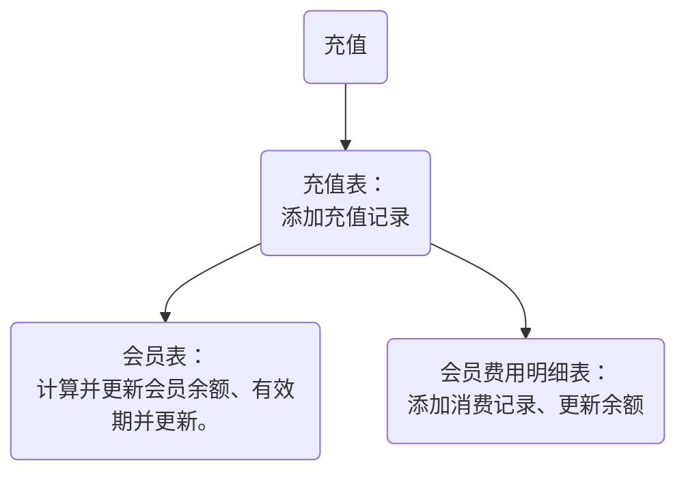
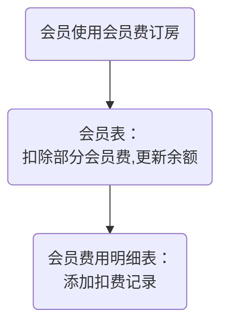
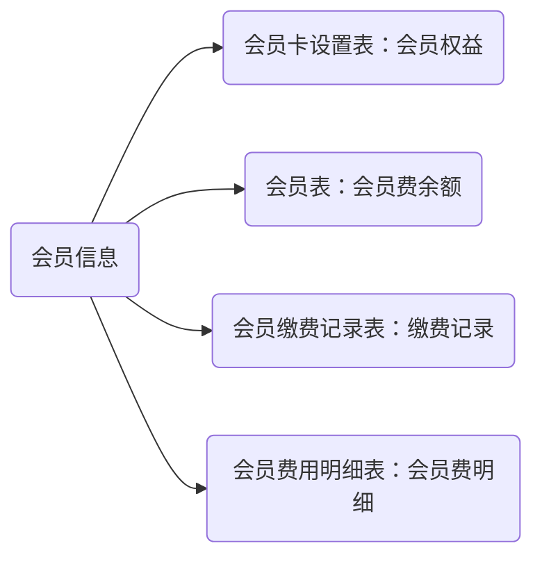

## 查阅房源
[ ] 房源明细
[ ] 房源地图 -> 房源明细
[ ] 微信注册
[ ] 微信登录
订房 -> [注册] -> [登录]
手机号登录 -
支付
我的订单
联系我们 -
个人中心 -> 我的订单
## 微信账号授权登录
- 编写微信账号授权获接口
- 编写微信手机号获取接口
- 缓存获取手机号和openid
- 使用手机号和openid登录接口

## 订单查看功能
- 查看订单界面

## 下单界面
## 房屋排期功能
- 日历展示功能。
- 排期查询接口。

## 付款功能
- 付款流程
- 微信订单生成接口
- 付款成功通知接口

下单->入住流程
退房流程x
客服（故障处理、答疑）

----
订单详细信息 - 
订单保留30分钟支付 -
房屋位置按钮改为 【导航】 -
房屋排期网页版
日期边界问题
申请位置接口
通知测试
建消息表
编写通知接口
订单成功 -> 订单详情页 -> []
入住天数
订单号

-------------------------------
订单复核
  订单核实确认（网页）-
  发送通知（后台接口）-
订单通知
  配置微信小程序通知功能（微信小程序后台）-
  编写微信小程序消息通知接口（后台接口）-
  请求消息通知权限（微信小程序）-
订单评论
  评论数据表：新增接口、查询接口、删除接口（后台）
  填写评论（微信小程序）-
  删除评论（微信小程序））
  查询评论（微信小程序）-

--------------------------------
## 会员业务设计
  会员缴费表：新增接口、查询接口、删除接口（后台）
  缴费、续费（微信小程序）
  会员展示（微信小程序）
  付款时优惠方案选择、算价（微信小程序）
  会员管理：查询、统计会员（网页）
- [-] 会员卡设置表
 - card_id 会员卡 ID
 - card_price 会员卡年费
 - card_cover 会员卡封面
 - card_type 会员卡类型
 - card_rights 会员卡权益
 - card_name 会员卡名称
  
- [-] 会员缴费表 lvj_vip_payments
 - ID
 - 用户 ID: user_id
 - 缴费年数
 - 缴费金额
 - 截止有效期
 - 缴费时间

- [-] 会员费明细表 vip_banlance_records
  - 会员编号
  - 变更时间
  - 变动金额
  - 余额
  - 变动原因：订房、续费

- [-] 会员表
  - vip_id: 会员 ID
  - card_id
  - user_id
  - create_time
  - start_time
  - end_time
  - balance

```sql
create table lvj_vip_payments (
    id            bigint(20)      not null auto_increment    comment 'ID',
    user_id               bigint(20)       not null   comment '用户ID',
    payment_years         smallint       not null   comment '缴费年数',
    amount                decimal(8,2)       not null   comment '缴费金额',
    out_trade_no          varchar(32)        not null   comment '交易编号'
    trade_state           varchar(32)        not null   comment '交易状态（未支付，已支付）'
    start_time            datetime     not null   comment '会员开始日期',
    end_time              datetime     not null   comment '会员截止日期',
    create_time          datetime        not null    comment '创建时间',
    primary key (comment_id)
  ) engine=innodb auto_increment=100 comment = '会员缴费表';
  会员卡配置表
  create table lvj_vip_card (
    card_id            bigint(20)      not null auto_increment    comment 'ID',
    card_name         varchar(16)     not null comment '会员卡名称', 
    year_price        decimal(8,2)       not null   comment '年费',
    card_cover         varchar(128)        not null   comment '会员卡封面',
    card_type          varchar(32)        not null   comment '会员类型',
    card_rights        varchar(1024)     not null   comment '会员权益说明',
    create_time        datetime        not null    comment '创建时间',
    create_by         varchar(64)     default ''   comment '创建者',
    update_by         varchar(64)     default ''   comment '更新者',
    update_time        datetime                    comment '更新时间'
    primary key (card_id)
  ) engine=innodb auto_increment=100 comment = '会员卡表';
;  会员表
  create table lvj_vip_user (
    vip_id            bigint(20)      not null    auto_increment    comment '会员ID(会员卡编号)',
    card_id           bigint(20)      not null    comment '会员卡ID',
    user_id           bigint(20)      not null    comment '用户ID',
    create_time       datetime        not null    comment '创建时间',
    start_time        datetime        not null    comment  '开始时间',
    end_time          datetime        not null    comment '结束时间',
    balance           decimal(8,2)    not null    comment '余额',
    primary key (vip_id)
  ) engine=innodb auto_increment=100 comment = '会员表';
;会员费用明细表
create table lvj_vip_user (
  id                bigint(20)      not null    comment 'ID',
  user_id           bigint(20)      not null    comment '用户ID',
  create_time       datetime        not null    comment '发生时间',
  start_time        datetime        not null    comment  '开始时间',
  end_time          datetime        not null    comment '结束时间',
  balance           decimal(8,2)    not null    comment '余额',
  primary key (vip_id)
) engine=innodb auto_increment=100 comment = '会员费用明细表';
```

## 会员卡配置 ✔
  接口
    更新会员卡信息 [-]
    查询会员卡 [-]
  会员卡配置界面（网页）
    查询会员卡 [-]
    更新会员卡 [-]
## 会员账号管理 ✔
  接口
    新增会员-后台用
    查询会员列表
    根据用户名、电话、会员Id查询会员
    更新余额、起止时间-后台用
  界面-网页
    查询会员列表
    查看会员详情
  界面-小程序
    查询会员详情
## 会员卡消费表 ✔
  接口
    新增消费记录-后台用
    查询消费记录
## 会员卡充值（缴费）表 ✔
  接口
    新增充值记录
    查询充值记录

## 会员充值逻辑



## 会员费支出逻辑



## 会员信息查询逻辑



-----------------------------
积分明细表 lvj_user_points
- ID
- 用户ID user_id
- 新积分 new_points
- 积分来源 points_source 0: 邀请新用户注册 1: 订房
- 来源明细 points_detail
- 创建日期

用户表
+ 积分 points

++++++++++++++++++++++++++++++++++++++++
————————————————————————————————————————
小院
  平台资产管理：出租年限和价格、房东信息、产权资料、可否改建、总房间数
  上架房源管理：照片、位置、交通、设施
  日常维护登记：
# BUGFIX
1. 小程序看不到户型图。✔

# FEATURE
1. 支持设置房源的至少订房天数。
2. 定时检查未付款订单。
3. 小院信息录入、查看、更新、订房。
4. 支持上传房源视频、播放视频。
- [ ] 15:32 
	Cesium 地球、星空透明
	```js
	  const viewer = new Viewer('map-dom', {
	
	    timeline: false, // 禁用时间线控件
	
	    animation: false, // 禁用动画控件
	
	    homeButton: false, // 禁用主页控件
	
	    geocoder: false, // 禁用地名搜索定位控件
	
	    navigationHelpButton: false, // 禁用帮助控件
	
	    sceneModePicker: false, // 禁用场景模式切换控件
	
	    baseLayerPicker: false, // 禁用底图切换控件
	
	    infoBox: false,
	
	    fullscreenButton: false,
	
	    // 允许透明
	
	    contextOptions: {
	
	      webgl: {
	
	        alpha: true,
	
	      },
	
	    },
	
	  });
	
	  
	
	  // 禁用版权信息控件
	
	  viewer._cesiumWidget._creditContainer.style.display = "none";
	
	  
	
	  viewer.imageryLayers.removeAll()
	
	  
	
	  // 星空
	
	  viewer.scene.skyBox.destroy();
	
	  viewer.scene.skyBox = undefined;
	
	  // 太阳
	
	  viewer.scene.sun.destroy();
	
	  viewer.scene.sun = undefined;
	
	  // 月亮
	
	  viewer.scene.moon.destroy();
	
	  viewer.scene.moon = undefined;
	
	  
	
	  // 大气层
	
	  viewer.scene.skyAtmosphere.destroy();
	
	  viewer.scene.skyAtmosphere = undefined;
	
	  
	
	  // 地球颜色
	
	  viewer.scene.globe.baseColor = Color.WHITE
	
	  // 星空背景色
	
	  viewer.scene.backgroundColor = Color.TRANSPARENT
	```
	
	#gis  